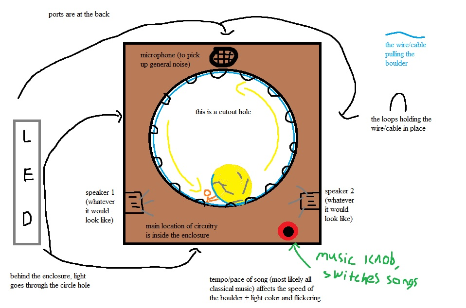

# laughing-octo-fiesta

#CPSC 334 Final Project, Creative Embedded Systems

In collaboration with Richard Corrente

##Description:
We’re going to stick with the Sisyphus theme, but we will make it less frustrating for the user and less ‘game-like’ overall. Our initial priority was to encourage the user to apply some degree of physical exertion. We realized that the screaming feature was an uncomfortable mode of interaction for a typical person, so we scrapped it.

We considered 4 ideas in depth - descriptions of the first 3 are attached in this email for reference of our thought process—also in the event that you two might actually like any of them. We switched gears to a more wholesome, artistic approach - idea 4.

In our current finalized plan, we were thinking of taking a less torture-focused approach for the user and have Sisphysus and the boulder rotate in a continuous circle, allow the user input to be a user-chosen song from a set of original music performed by Lucy (classical piano), and the LEDs and motion of Sisphyus and the boulder “pulse” to the music beat (the range of music would vary from slower tempos to faster ones). This would allow a more “installation-like” system and allow us to focus on craftsmanship of the enclosure, which we anticipate would take an extensive amount of time.

Attached is a diagram of the revised approach. We would welcome any feedback you and/or Joe may have as we continue implementing our design!

## Finalized Materials List