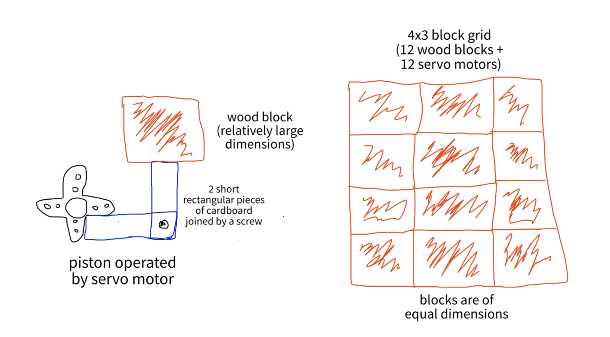

# laughing-octo-fiesta

# CPSC 334 Creative Embedded Systems: Final Project

In collaboration with Richard Corrente

## Description:
We’re going to stick with the Sisyphus theme, but we will make it less frustrating for the user and less ‘game-like’ overall. Our initial priority was to encourage the user to apply some degree of physical exertion. We realized that the screaming feature was an uncomfortable mode of interaction for a typical person, so we scrapped it.

We considered 4 ideas in depth - descriptions of the first 3 are attached in this email for reference of our thought process—also in the event that you two might actually like any of them. We switched gears to a more wholesome, artistic approach - idea 4.

The project is a "physical low-fi sound board", a low-fi display made from 64 wooden blocks. The display utilizes a combination of physical and digital elements; each wooden block serves as a pixel, collectively forming a tangible and visually appealing interface. The blocks making up the "pixelated" canvas/display are individually controlled through an Arduino microcontroller, allowing for dynamic patterns and designs. Namely, we are physically visualizing sound levels (pitch and/or volume) in real time, mapped to the amount of projection/depth and/or specific blocks that move on the board. With this project, we wanted to focus primarily on artistry and technology, specifically meshing tangible, hands-on craftsmanship and digital programming. The wooden block display serves as an engaging and aesthetically pleasing means of conveying information or creating interactive visualizations.

## Finalized Materials List

### Hardware List:
1. 12 (or more) servo motors: $0 (so far)
2. Wood: $0 (so far)
3. Servo shield (https://www.adafruit.com/product/1411 - $17.50): 4. $0, already in AKW
5. Microphone (https://www.adafruit.com/product/1063): $6.95

### Piston mechanism:
Quick burst of force…this will hopefully maximize our chances of smooth and synchronized movement
The wood block will only move forward enough to distinguish itself from the rest state, so as to not expose the servo motor + piston

### Concerns:
Need to make sure the movement of each piston (12 total) is as synchronized and smooth as possible

### Block grid:
For now, 12 wooden blocks compose the grid. This might change in the future depending on the clarity of each grid arrangement.
Each wooden block will have some sort of a design on them
Can be the representation of its respective sound wave

### Microphone:
Detecting significant ambient sounds in the surrounding environment.
We will read through the sound waves produced by whatever noise is in the environment, and then attempt to match a particular sound wave to one of the blocks (is this possible?? Need to think about it more)

### Concerns:
Sensitivity will probably require extensive testing
How much noise will the esp32 produce on its own? The Adafruit shop page claims this shouldn’t be an issue if the mic uses the 3.3V pin, but that is just a claim.
